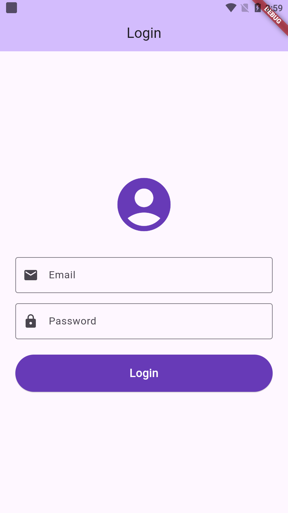
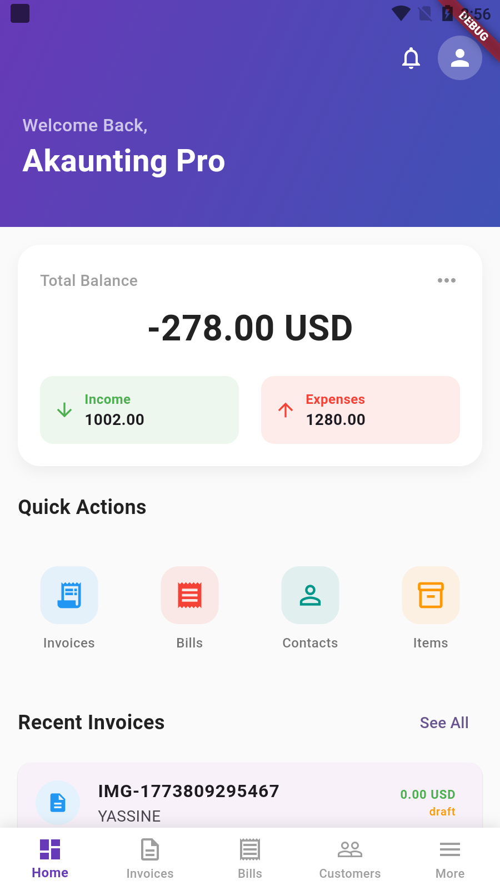
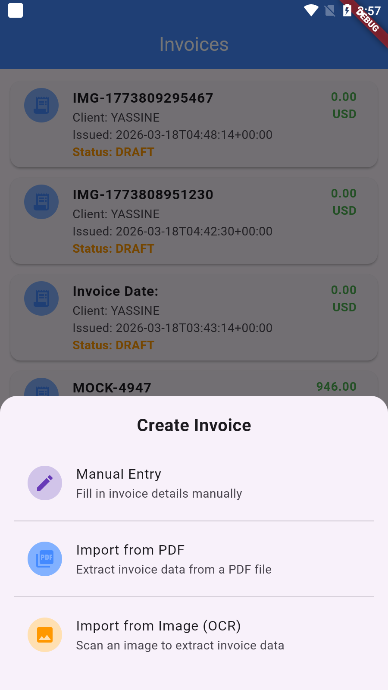
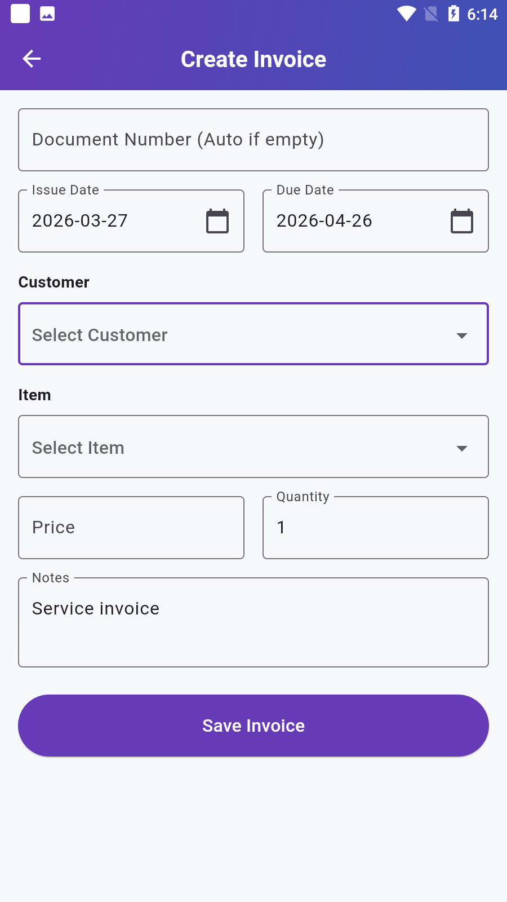
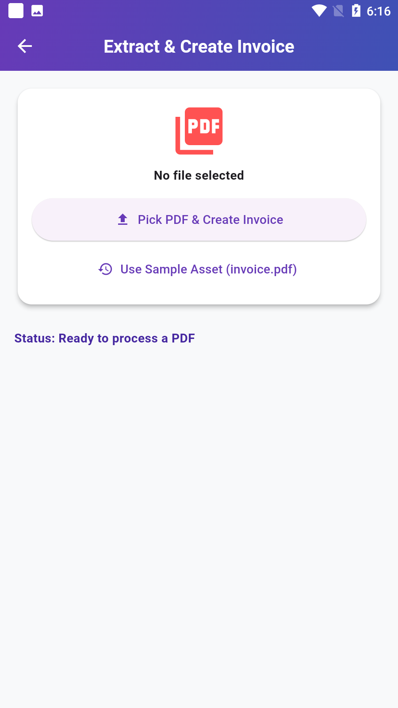
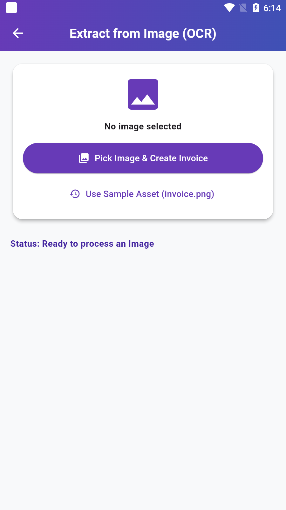
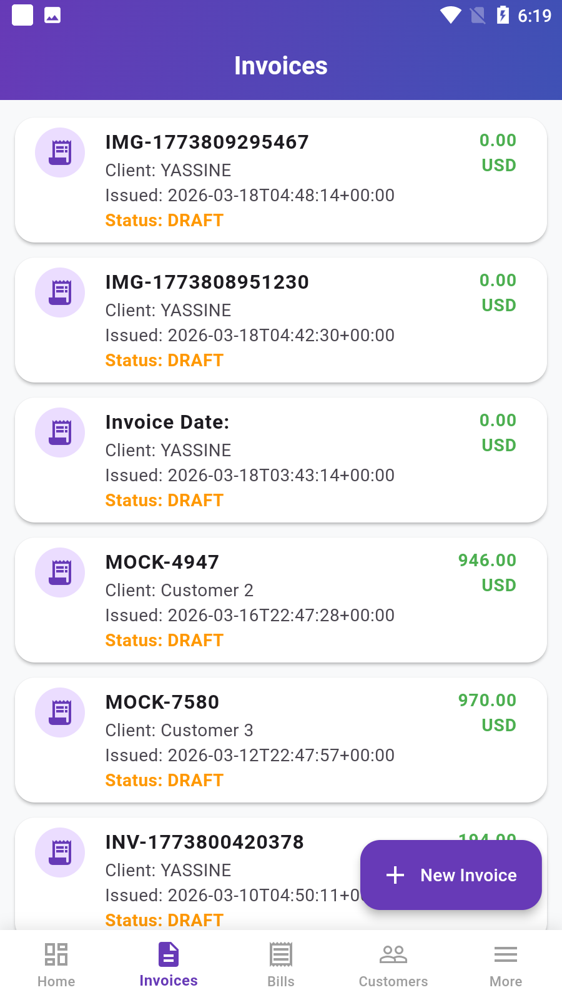
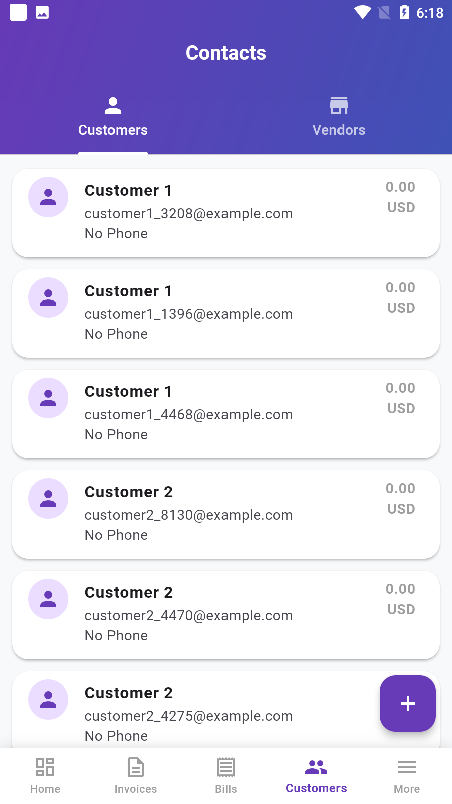
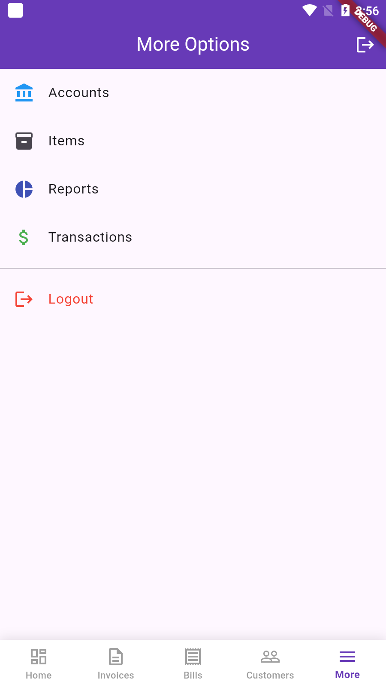

# Akaunting Mobile Client

A powerful Flutter-based companion app for **Akaunting**, designed to streamline your business management on the go.

## 🔐 Get Started

Login with your **Akaunting account** to sync your data across all devices and start managing your business anywhere.



## ✨ Key Features

### 📊 Professional Dashboard

Stay updated on your financial status with real-time totals for Balance, Income, and Expenses. Access quick actions to generate invoices and manage your business.



### 📄 Intelligent Invoice Creation

Seamlessly create new invoices with multiple input methods:

- **Manual Entry**: Full control over all details.
- **Import from PDF**: Automate data extraction from existing PDF documents.
- **OCR Scanning**: Use cutting-edge Image-to-Text extraction and OCR.



#### 🛠️ Creation Methods Gallery

| Manual Entry | OCR PDF | OCR Image |
| :---: | :---: | :---: |
|  |  |  |

### 💰 Comprehensive Financial Lists

Manage your **Invoices** and **Bills** with clear status tracking (Draft, Sent, Paid, etc.).

| Invoices | Bills |
| :---: | :---: |
|  |  |

### 👥 Global Contact Directory

Organize and interact with your Customers and Vendors in a unified directory.



### ⚙️ More & More

Manage Accounts, Items, Reports, and Transactions all from the options menu.



## 🚀 Installation & Local Development

### 1. Backend Setup

The mobile application requires a running **Akaunting** instance as its backend.

- **Repository**: [Akaunting/Akaunting](https://github.com/akaunting/akaunting)
- Ensure your local server is running and the API is accessible.

### 2. Configure Environment

Create a `.env` file in the root of the `my_app` directory. You can use the `.env.example` file as a template.

```bash
# Example .env content
BASE_API=http://192.168.1.116/akaunting/api
```

### 3. Flutter Setup

1. **Clone the repository.**

2. **Install dependencies**:

   ```bash
   flutter pub get
   ```

3. **Run the app**:

   ```bash
   flutter run
   ```

## 🛠 Tech Stack

- **Flutter**: UI Framework.
- **Dart**: Core Language.
- **Bloc/Cubit**: State Management.
- **Google ML Kit**: OCR and Text Recognition.
- **Syncfusion**: PDF Generation and Handling.
- **HTTP**: API Integration.

---


